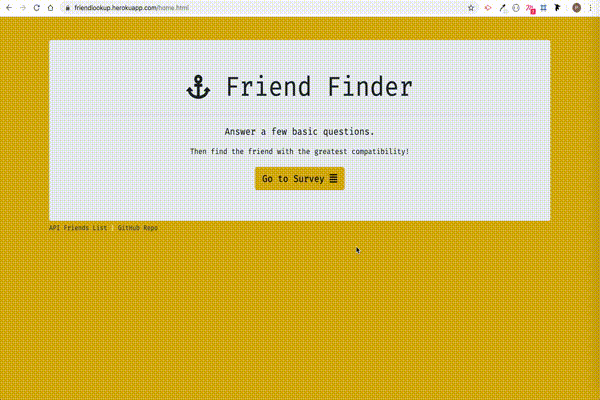

# FriendFinder

## 1. Problem Statement

  * A compatibility-based **"FriendFinder"** application -- basically a dating app for friends. 

  * This full-stack site will take in results from your users' surveys, then compare their answers with those from other users. The app will then display the name and picture of the user with the best overall match.

## 2. Organisation

**server.js**
  * Set up express node server, listening on port.
  * Set up routes for html and api.

**htmlRoutes.js**
  * Set up Routes that direct to "home" and "survey" URL.
  * Route file structured as per standard (app --> routing --> htmlRoutes.js)

**apiRoutes.js**
  * Set up Routes that "Get" data from Friends API and redirects to Friends API JSON.
  * Set up Routes that "Post" the data from the user filled form as request and filter the result to find the best matching friend from the API list. Returns the best matching potential friend.
  * Route file structured as per standard (app --> routing --> apiRoutes.js)

**home.html**
  * Home page Layout, with option buttons/links to so to the Survey page, Friends API or Github Repo.
  * HTML file structured as per standard (app --> public --> home.html)

**survey.html**
  * Survey Page Form, for user to fill in the information.
  * When form is sent, results appear in form of Modal.
  * Option button to go back to Home screen.
  * HTML file structured as per standard (app --> public --> survey.html).

**friends.js**
  * Stores Friends API data to compare the information from.
  * API file structured as per standard (app --> data --> friends.js).

## 3. Working Commands

To use this app, visit,

https://friendlookup.herokuapp.com/

App is uploaded on Heroku, on the link above.

## 4. Demo

## 5. Technologies Used

### Package dependencies

* **express**
* **path**

## 6. Role

This app is completely developed by me.
